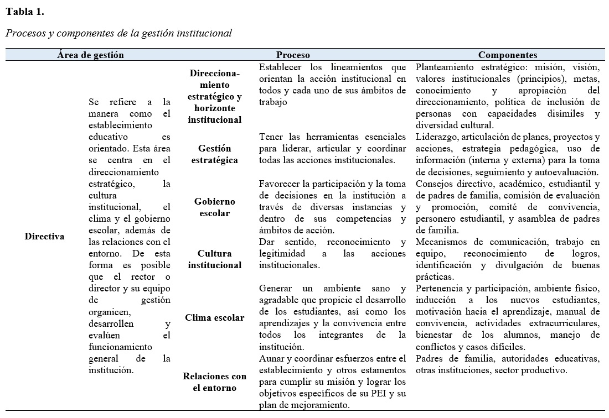
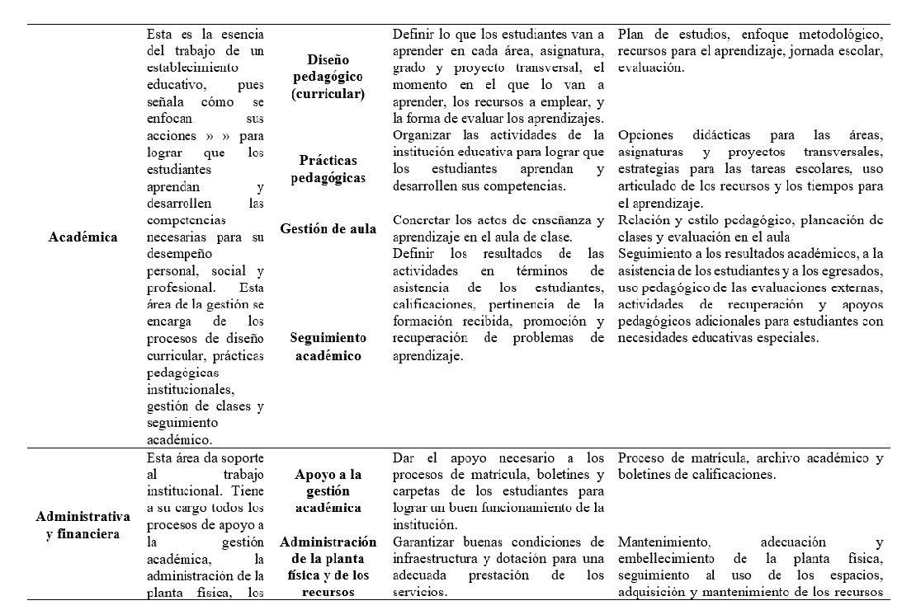
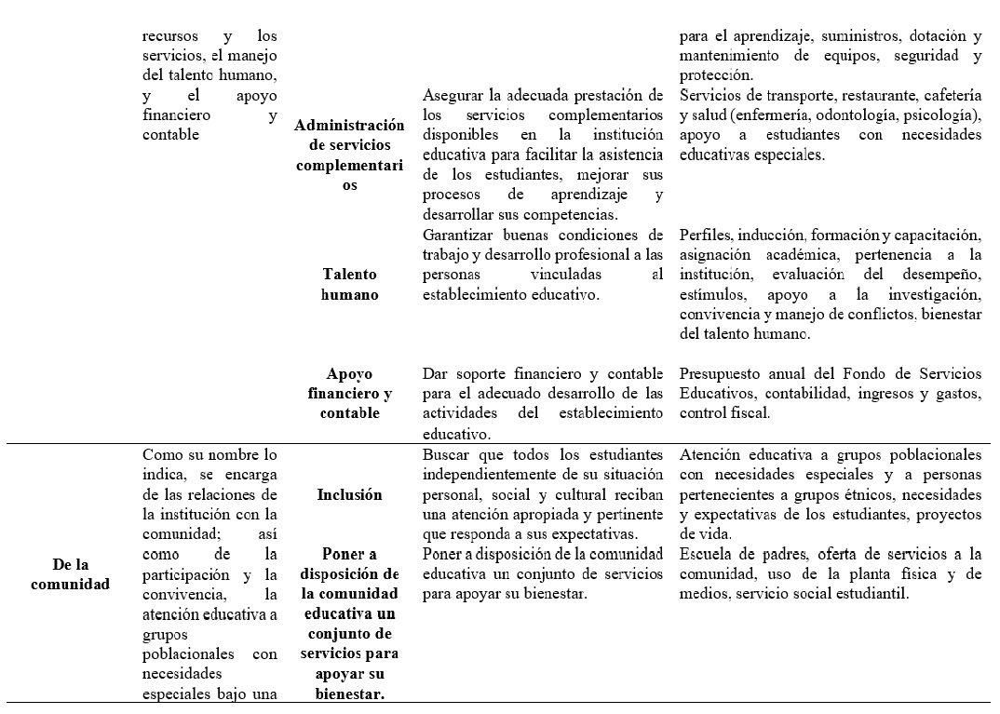
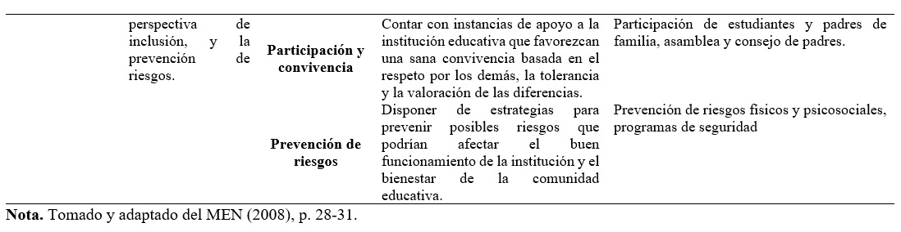
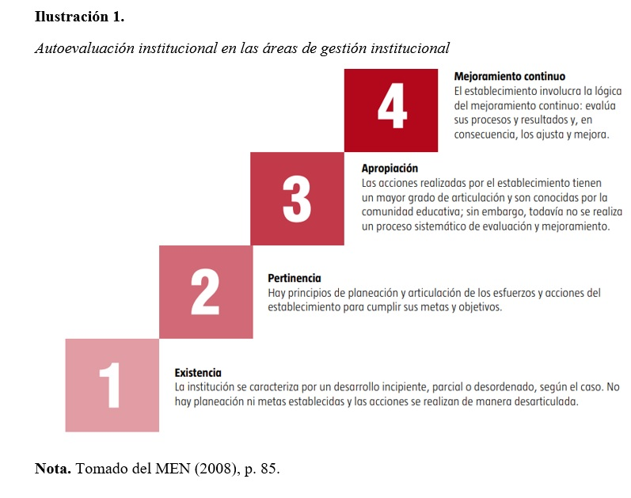
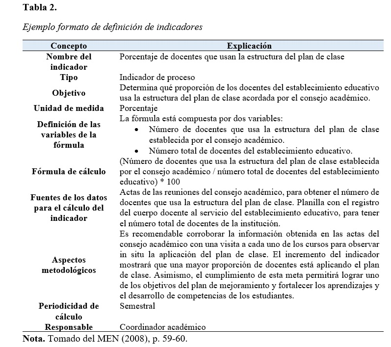
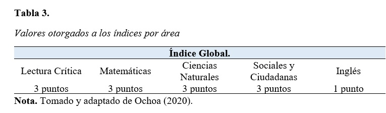
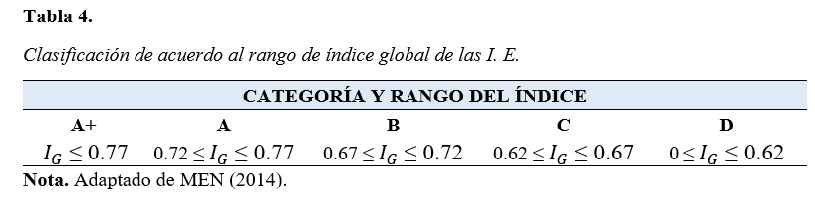

# Marco Teorico

## Descentralización y autonomía institucional

El Ministerio de Educación Nacional (MEN) (2008), encuentra necesario procurar la descentralización del sistema educativo con el objeto de fomentar y fortalecer la autonomía institucional, en tanto, las instituciones educativas del país y los educadores vinculados a las mismas (desde el rol de rectores, docentes, entre otros) deben asumir un papel activo en torno a los temas pedagógicos y la formación docente. 

Por consiguiente, la descentralización genera una apertura de posibilidades para el fomento y difusión de la innovación educativa, el liderazgo institucional, el desarrollo de proyectos pedagógicos autónomos, y a su vez, favorece el garantizar el acceso y la cobertura educativa en los contextos locales de forma pertinente, al dar respuesta a las necesidades y requerimientos locales de manera coordinada, coherente, eficiente y oportuna. 

De tal forma, que bajo la Ley de Competencias y Recursos de 1993; La Ley General de Educación de 1994;  y la Ley 715 de 2001. El MEN determinó una política a partir de la cual su rol pasó a ser el de ejercer vigilancia y control sobre el servicio educativo prestado a nivel nacional. Mientras a cada entidad educativa certificada, a nivel departamental, distrital y municipal, se le confirió la autoridad jurisdiccional para de manera autónoma dar atención a las necesidades de la población local (MEN, 2008). 

Esta autonomía a su vez conlleva la responsabilidad de elaborar y desarrollar los proyectos educativos institucionales (PEI); planes de estudio; métodos pedagógicos; y la forma de organizar el trabajo. El gobierno escolar, también se consolido como un organismo capaz de representar los intereses de cada miembro de la comunidad educativa a partir de una postura democrática. 

La descentralización política y administrativa colombiana ha sido fundamental para permitir el posicionamiento de los establecimientos educativos como espacios donde se materializa la educación pertinente y de calidad para todos, a través de proyectos concretos, definidos y concertados por toda la comunidad educativa (MEN, 2008, p. 14).

Ahora bien, el propósito de garantizar la descentralización partía de un principio de equidad, a partir del cual se buscó garantizar que todos los niños, niñas y jóvenes del país accedieran a un ciclo completo de educación básica (Preescolar, básica y media). 

La autonomía escolar brindada a cada establecimiento para definir su identidad y plasmar esto en sus respectivos PEI, permitió generar una mayor organización en los planes de estudio en lo que respecta a las áreas fundamentales, los lineamientos curriculares, estándares básicos de competencias, entre otras características a partir de las cuales se aludía a la inclusión y diversidad social. 

Sin embargo, estos procesos, debían generar un principio de integración desde la unificación de los proyectos educativos institucionales. En tanto, resulta necesario establecer condiciones de conciliación a las cuales debe responder cada entidad educativa para abordar un mismo horizonte institucional en el país. Al contemplar la necesidad de fortalecer los ciclos de educación básica y disminuir los índices de deserción académica
De allí, que se considere: 

Que todos los integrantes de la comunidad educativa puedan trabajar en un proyecto común, fruto de la concertación y el consenso alrededor del propósito de garantizar la mejor educación para todos los estudiantes, sin importar sus orígenes, ni sus condiciones sociales, económicas y culturales (MEN, 2008, p. 14).

Razón por la cual, para conseguir esta meta resulta indispensable que las entidades establezcan acciones de planeación, seguimiento y evaluación. En tanto, la comunicación y el trabajo en equipo se consolidan como aspectos fundamentales que deben ser integrados por la comunidad educativa para procurar el logro de sus principios institucionales. 

La comunicación resulta un elemento clavé, debido a que se reconoce como un proceso fundamental que implica poner en práctica la habilidad de escucha, para transmitir una idea o mensaje, determinando pautas para generar un proceso de retroalimentación. 

El trabajo en equipo, por otra parte facilita la consolidación de la toma de decisiones, fortaleciendo los aprendizajes individuales y colectivos. De tal forma que al trabajar en conjunto “aumentan las posibilidades de tener resultados y productos más sólidos, pues todos los integrantes del equipo se vinculan para aportar sus ideas, experiencias y conocimientos” (p. 15).

La utilización de estos datos, guía el accionar para generar una ruta de mejoramiento institucional. A partir de la cual se establezcan estrategias para determinar si se han alcanzado los resultados deseados, o se deben generar procesos de evaluación y ajuste.

## Mejoramiento institucional

Los establecimientos educativos deben incentivar una educación de calidad, de allí que para lograr que los estudiantes logren un nivel satisfactorio en torno al desarrollo de competencias y potencien sus capacidades, participando de la formación de ciudadanos integrales. Resulta necesario fortalecer el sistema de aseguramiento el cual se constituye por tres elementos: los estándares básicos de competencias para las áreas fundamentales; la evaluación institucional; y el mejoramiento (MEN, 2008).

En tal sentido, se comprenden los estándares básicos de competencias, como criterios claros que orientan el diseño curricular de los planes de estudio; la definición de estrategias pedagógicas y las rubricas de evaluación del aprendizaje. De igual forma, estos establecen parámetros mínimos que deben adquirir los estudiantes en su ciclo de aprendizaje. 

La evaluación, por su parte, se sustenta en el cumplimiento de objetivos y metas, de tal forma que permiten delimitar las acciones a seguir para procurar la optimización de los resultados obtenidos por una entidad. En este caso, las evaluaciones se realizan periódicamente (Pruebas Saber), brindan información sobre los conocimientos formativos de las áreas fundamentales, y facilitan el identificar fortalezas y necesidades de formación con el objeto de superar las dificultades y barreras de aprendizaje que puedan ser identificadas (MEN, 2008). 

El mejoramiento, por ende, resulta el tercer elemento del ciclo de calidad, y se logra al fortalecer las capacidades institucionales en torno a la formulación, ejecución, y seguimiento de resultados de los planes de mejoramiento institucional. 

## Procesos y componentes en la gestión para el mejoramiento institucional

La gestión institucional abarca diferentes áreas, procesos y componentes, que permiten a las entidades educativas desarrollar sus capacidades y articular sus procesos internos para cumplir sus objetivos y propósitos. Todos ellos, aspectos que deben contemplarse al determinar una ruta de mejoramiento institucional. 

A continuación, la Tabla 1, presenta los procesos y componentes de la gestión institucional. 

## Ruta de mejoramiento institucional 

Son tres los ámbitos que deben considerarse al establecer una ruta de mejoramiento institucional. Estos se consideran como las etapas de autoevaluación institucional, elaboración del plan de mejoramiento, y seguimiento – evaluación.
En primera instancia la autoevaluación permite recopilar, sistematizar, analizar y valorar las fortalezas y debilidades de las cuatro áreas de gestión institucional, de tal forma, que estos aspectos sirven de base para la formulación del plan de mejoramiento. 

Resulta necesario mencionar que entre los elementos contemplados en el mejoramiento institucional, desde la etapa de autoevaluación, se encuentran cuatro fases, a considerar, las cuales, a continuación, se presentan en la Ilustración 1, autoevaluación institucional a partir de las áreas de gestión institucional.

Luego de esto, se prevé la segunda etapa, la cual consiste en la formulación del plan de mejoramiento, en el cual se definen objetivos, metas, indicadores de resultados, actividades, tiempos y responsables para el logro de objetivos y propósitos. 

Ahora bien, los objetivos deben establecerse considerando un plazo de tres años para la implementación del plan de mejoramiento. Mientras a su vez se consideras factores críticos internos y externos que afectan el desempeño institucional. Para ello, se contemplan los criterios de urgencia (necesidad de superación de un factor crítico); tendencia (agravantes de la situación institucional); e impacto (incidencia en la consecución de resultados).

Finalmente, en última instancia, se considera el seguimiento periódico del desarrollo del plan de mejoramiento, de tal forma que se observa la consecución de resultados y la necesidad de establecer ajustes que conlleven al logro de las metas iniciales definidas. 

## Indicadores de resultados

Los indicadores permiten delimitar el seguimiento y evaluación de un logro, debido a que facilitan la medición de un resultado, y por ende el ajuste situacional para la toma de medidas correctivas. 

“Se conciben como una expresión numérica entre dos o más variables que permiten medir, evaluar y comparar en el tiempo el desempeño de los procesos, productos y servicios del establecimiento educativo, de acuerdo con sus objetivos estratégicos y metas” (MEN, 2008, p. 58).

En tanto, como expresiones numéricas, estos deben estar bien definidos. De tal forma que a la hora de elaborar un indicador un investigador debe contemplar que estos sean: relevantes y pertinentes; exactos y consistentes; objetivos; mensurables; fácilmente interpretables, viables; cotejables; válidos; perdurables; y servir de apoyo para la toma de decisiones. 

Razón por la cual resulta necesario señalar de acuerdo con el MEN (2008), y MEN (2013), entre los indicadores que existen se contemplan los: 

De proceso: Los cuales brindan información durante un proceso a través del monitoreo de la información, sentando bases que permitan efectuar medidas correctivas en caso de ser necesario. 

De resultado: Estos miden los efectos obtenidos durante un proceso y al éxito o fracaso en el logro de metas y resultados deseados. 

Por otra parte, la Tabla 2, presenta un formato contemplado en la definición de indicadores.

## Clasificación de planteles

En el proceso de mejoramiento institucional, los exámenes efectuados por el Estado, a través de las Pruebas Saber, permiten establecer procesos para identificar fortalezas y debilidades institucionales. 

De allí que a partir de la obtención de estos resultados, se genera una clasificación de los planteles, a los cuales se les asigna una determinada categoría, dependiendo de los resultados arrojados en las Pruebas Saber 11.

Esta clasificación establece los niveles: A+; A; B; C; y D. Entendiendo A+ como la clasificación otorgada a los colegios con los mejores desempeños académicos, y D a aquellos con los desempeños más bajos (Ochoa, 2020).

Resulta necesario considerar que la clasificación no toma en cuenta los resultados del último año en que se presentan estas pruebas, sino que por el contrario considera los resultados institucionales obtenidos en los últimos 3 años.

Por consiguiente resulta necesario determinar un índice por áreas, el cual parte de la definición del grupo de notas sobre el cual se realizara el cálculo; el promedio de las frecuencias acumuladas obtenidas por los estudiantes en cada puntaje posible, desde 100 hasta 0, resultado que luego se divide en 1 menos la varianza de dichas frecuencias (Ochoa, 2020). 

Para calcular este índice, el MEN (2014), sugiere utilizar la siguiente formula:

$$I_{p}=\frac{\mu _{Fp}}{1-\sigma _{Fp}^{2}}$$

Por otra parte se busca obtener un índice global, el cual corresponde al promedio ponderado de los índices de las áreas de lectura crítica, matemáticas, ciencias naturales, sociales y ciudadanas, e inglés, a las cuales, de acuerdo con la Tabla 3, se les asignan las siguientes puntuaciones.

Mientras a su vez, se utiliza la siguiente formula en la determinación del índice global (MEN, 2014): 

$$I_{G}=\frac{\left ( I_{M}*3 \right )+\left ( I_{LC}*3 \right )+\left ( I_{CN}*3 \right )+\left ( I_{SCC}*3 \right )+\left ( I_{I}*3 \right )}{13}$$

El índice global obtenido, refleja a su vez la clasificación que será otorgada a un establecimiento educativo específico, según el rango en el cual se ubique a la institución, tal como presenta la Tabla 4.

